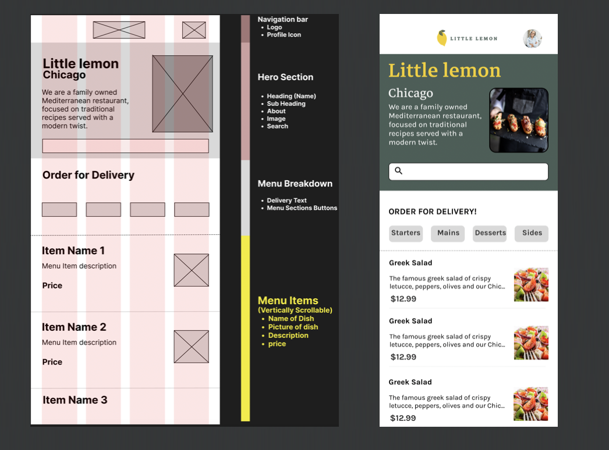
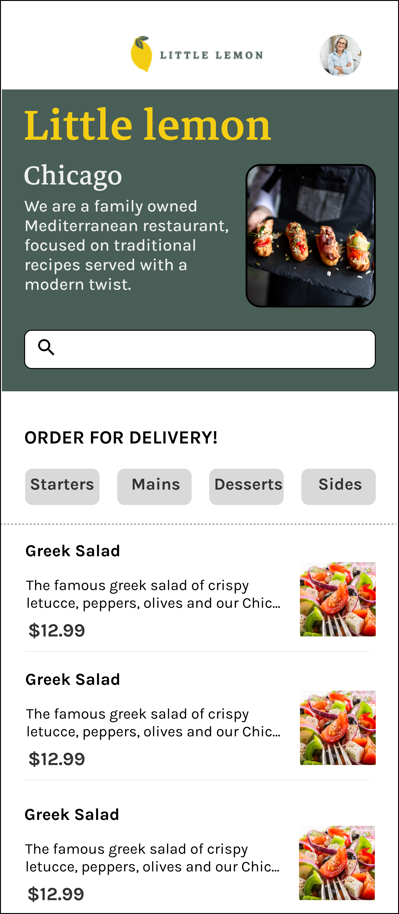

<h1 align="center">Little Lemon</h1> 

<p align="center">
This app was created to learn more about Android following all the fundamentals learned in the different android courses created by Meta
</p>

## Installation

Clone this repository and import into **Android Studio**

```bash
git clone https://github.com/munbonecci/LittleLemon.git
```

## Build variants

Use the Android Studio *Build Variants* button to choose between **debug** and **release** flavors

## Maintainers

This project is maintained by:

* [Edmundo Bonequi](http://github.com/munbonecci)

## Built with

- [Kotlin](https://kotlinlang.org/) - For coding.
- [Ktor](https://ktor.io) -Create asynchronous client and server applications. Anything from 
    - microservices to multiplatform HTTP client apps in a simple way.
- [SharedPreferences](https://developer.android.com/reference/android/content/SharedPreferences) 
    - Interface for accessing and modifying preference data
- [Glide Compose](https://bumptech.github.io/glide/int/compose.html) -This library integrates with 
    - Compose to allow you to load images in your Compose apps with Glide in a performant manner.
- Jetpack
    - [Compose](https://developer.android.com/jetpack/compose?gclid=CjwKCAiAzKqdBhAnEiwAePEjkkbfP8b_r6c57F3jtdwOjxWpBbNOXVmpSnAUu4HKCid7KtSvfiiYeRoC1wYQAvD_BwE&gclsrc=aw.ds)
        - Android’s recommended modern toolkit for building native UI.
    - [Navigation Component](https://developer.android.com/guide/navigation/navigation-getting-started)
        - Handling and manage the navigation in the app.
    - [Room database](https://developer.android.com/training/data-storage/room)
        - The Room persistence library provides an abstraction layer over SQLite to allow fluent database 
        - access while harnessing the full power of SQLite.

## How I run the app?

- Clone the repository
- Open it in Android Studio
- Wait until dependencies are installed
- If you have compilation problems, it may be necessary to add the correct .jdk which can be corretto 11 or something similar.
- Run app in your emulator or physical device



